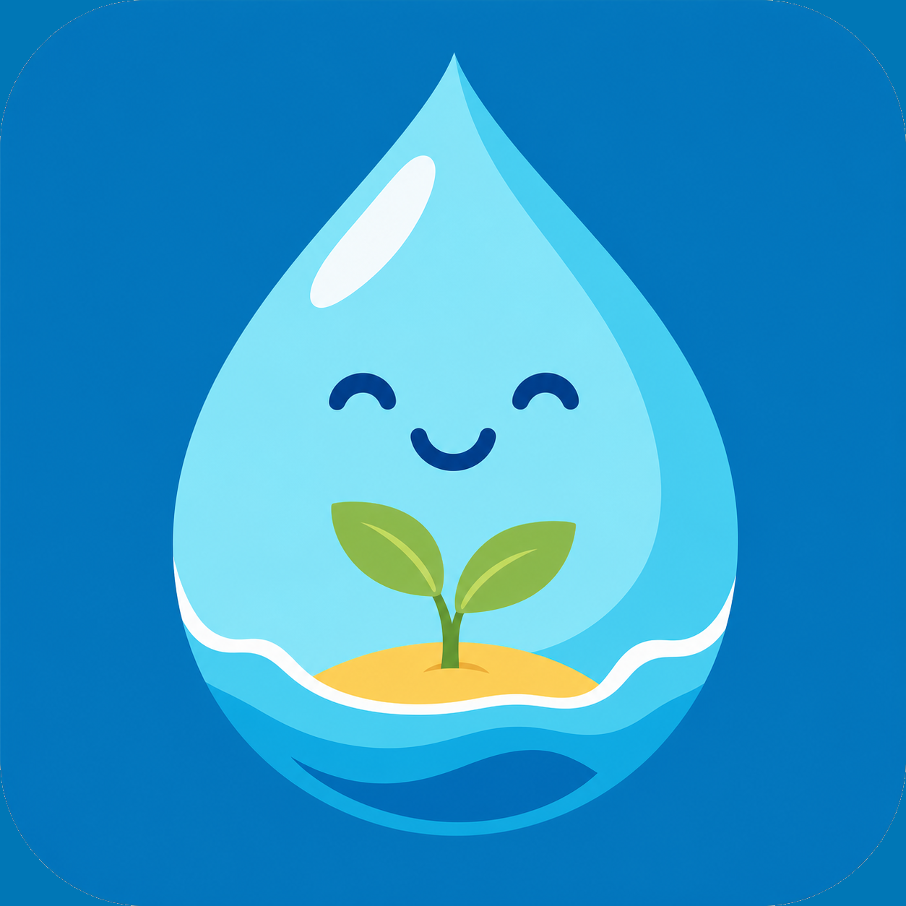

# Oasis — Water Tracker

<p align="center">
  
</p>

Oasis — автономное PWA-приложение для учёта напитков и эффективной гидратации.
Оно работает без регистрации и бэкенда: история, каталог и настройки хранятся
локально на устройстве пользователя.

**Приложение:** [muchunzyan.github.io/water-tracker](https://muchunzyan.github.io/water-tracker)

## Основной функционал

### Главный экран «Сегодня»

- показывает фактически выпитый объём и эффективную гидратацию;
- рассчитывает процент выполнения дневной цели с округлением вниз;
- показывает, сколько миллилитров осталось до цели;
- отображает текущую серию дней с выполненной нормой;
- выводит последние записи за сегодняшний день;
- позволяет изменять и удалять записи;
- прокручивает страницу к индикатору и запускает анимацию при достижении 100%;
- автоматически начинает новый день, сохраняя предыдущие данные в истории.

Эффективная гидратация зависит от коэффициента выбранного напитка:

```text
эффективная гидратация = объём × процент гидратации / 100
```

Например, 300 мл напитка с гидратацией 80% дают 240 мл эффективной гидратации.

### Добавление записей

- выбор напитка из каталога с поиском;
- сортировка вариантов сначала по частоте использования, затем по алфавиту;
- автоматическая подстановка напитка и объёма из последней записи;
- четыре быстрых объёма, сформированные из наиболее часто используемых значений;
- ручной ввод объёма от 1 до 5 000 мл;
- предварительный расчёт эффективной гидратации;
- редактирование уже сохранённых записей.

Запись сохраняет снимок названия, коэффициента, цвета и иконки напитка. Поэтому
история не меняется после редактирования или удаления напитка из каталога.

### Персональная дневная цель

При первом запуске Oasis предлагает указать:

- рост;
- вес;
- уровень активности;
- нужно ли учитывать температуру воздуха.

По этим данным рассчитывается ориентировочная базовая цель. В настройках параметры
можно изменить, выполнить повторный расчёт или вручную задать итоговую цель от 250
до 10 000 мл.

На главном экране к базовой цели могут применяться дневные поправки:

- **тренировки:** +600 мл за каждый указанный час тренировки;
- **жара:** +100 мл за каждый градус максимальной температуры выше 25 °C.

Количество часов тренировки поддерживает дробные значения до двух знаков после
запятой и сбрасывается для нового календарного дня.

### Погода и работа без сети

Температурная поправка включается пользователем и использует
[Open-Meteo](https://open-meteo.com/):

1. приложение запрашивает геолокацию;
2. загружает максимальную температуру на текущий день;
3. сохраняет прогноз локально и не запрашивает его повторно в тот же день;
4. использует сохранённый прогноз, даже если интернет позднее пропал.

Если прогноз загрузить не удалось, Oasis продолжает работать без температурной
поправки и повторяет попытку при следующем запуске приложения.

### Каталог напитков

- расширенный встроенный каталог с разными коэффициентами гидратации;
- собственные иконки и цвета категорий напитков;
- создание пользовательских напитков;
- редактирование и удаление как пользовательских, так и встроенных напитков;
- восстановление исходного встроенного каталога в настройках;
- поиск по названию;
- сортировка по алфавиту или проценту гидратации в обоих направлениях;
- сохранение выбранного режима сортировки между запусками.

### История и статистика

- переход между календарными днями;
- список записей и итог выбранного дня;
- фактически выпитый объём, эффективная гидратация и процент выполнения;
- недельная диаграмма с возможностью выбрать день;
- редактирование и удаление записей непосредственно из истории;
- единый вид карточек напитков на экранах «Сегодня», «История» и «Напитки».

### Настройки

- ручная дневная цель;
- повторный персональный расчёт по росту, весу и активности;
- включение и отключение температурной поправки;
- системная, светлая и тёмная темы;
- восстановление встроенных напитков;
- экспорт всех данных в JSON;
- проверяемый импорт резервной копии с полной заменой локальных данных;
- полный сброс истории, пользовательских напитков и настроек;
- инструкция по добавлению Oasis на домашний экран iPhone.

### PWA и обновления

- установка на домашний экран iPhone и поддерживаемых платформ;
- адаптивный интерфейс для мобильных и настольных экранов;
- учёт безопасных областей iPhone;
- кэширование app shell и статических ресурсов через Workbox;
- запуск без интернета после первого успешного открытия;
- уведомление о доступной новой версии и обновление по подтверждению пользователя;
- сохранение IndexedDB при обновлении service worker.

## Локальное хранение данных

Oasis не отправляет журнал напитков на сервер. Основные данные хранятся в IndexedDB
через Dexie:

- `drinks` — встроенные и пользовательские напитки;
- `entries` — записи с временной меткой и снимком напитка;
- `settings` — цель, профиль, тема, тренировки и сохранённый прогноз.

Очистка данных браузера может удалить локальную историю, поэтому для переноса между
устройствами предусмотрены экспорт и импорт JSON-резервной копии.

## Технологии

- React 19 и TypeScript;
- Vite 8;
- shadcn/ui на Base UI с пресетом `b1G3wwsPg`;
- Tailwind CSS 4 и CSS Modules;
- Dexie и IndexedDB;
- Zod для валидации данных и резервных копий;
- date-fns для локальных календарных расчётов;
- Lucide React для интерфейсных иконок;
- vite-plugin-pwa, Workbox и web app manifest;
- Vitest, Testing Library, Playwright и Lighthouse.

## Документация

- [Архитектура](./docs/architecture.md)
- [Модель данных](./docs/architecture.md#44-локальное-хранилище)
- [Методика расчёта гидратации](./docs/hydration-methodology.md)
- [План реализации](./docs/implementation-plan.md)
- [Архив реализованных улучшений](./docs/future-improvements.md)
