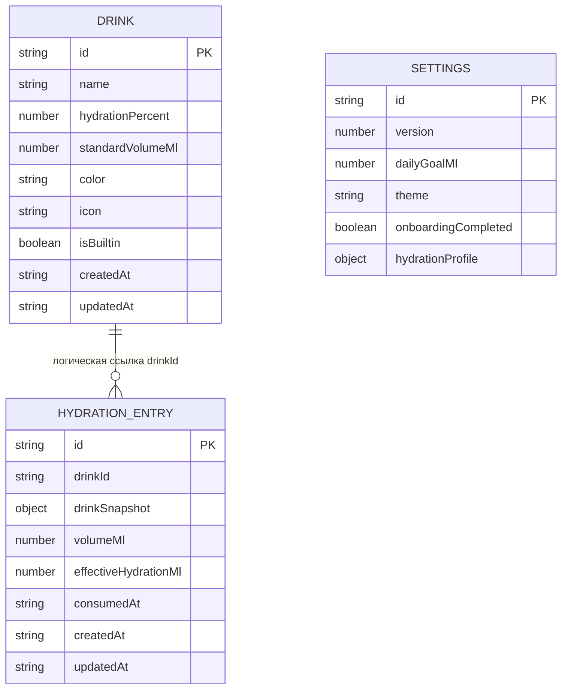

# Архитектура приложения для отслеживания гидратации

Статус: принято 11 июля 2026 года.  
Тип документа: живой архитектурный документ.

Этот файл фиксирует согласованные продуктовые и технические решения. По мере разработки его необходимо обновлять: добавлять новые решения, уточнять структуру приложения и отмечать изменения первоначальных договорённостей.

Последовательность разработки и критерии готовности этапов описаны в [плане реализации](./implementation-plan.md).

## 1. Назначение продукта

Приложение помогает пользователю отслеживать количество выпитой жидкости и эффективную гидратацию за день. По характеру взаимодействия оно вдохновлено WaterLlama, но использует собственный визуальный стиль, иллюстрации и интерфейс.

Приложение создаётся как PWA и должно одинаково удобно работать:

- в браузере на компьютере;
- в мобильном браузере;
- в standalone-режиме после добавления на экран «Домой» iPhone;
- без подключения к интернету после первого успешного открытия.

Бэкенд, удалённая база данных и авторизация не используются. Пользовательские данные хранятся локально на текущем устройстве.

## 2. Функциональные требования

### 2.1. Дневная цель

- Пользователь задаёт дневную цель в миллилитрах.
- Главный экран показывает выпитый объём, эффективную гидратацию и процент выполнения цели.
- Новый календарный день начинается автоматически, а предыдущие записи остаются в истории.

### 2.2. Записи о напитках

- Пользователь выбирает напиток и указывает фактически выпитый объём.
- Доступны быстрые варианты объёма и произвольный ввод в миллилитрах.
- Каждая запись содержит время, напиток, фактический объём и рассчитанную эффективную гидратацию.
- Записи можно редактировать и удалять.

Расчёт эффективной гидратации:

```text
effectiveHydrationMl = volumeMl × hydrationPercent / 100
```

Например, 300 мл напитка с гидратацией 80% дают 240 мл эффективной гидратации.

### 2.3. Каталог напитков

- В приложении есть предустановленные напитки.
- Пользователь может создавать, редактировать и удалять собственные напитки.
- Напиток содержит название, процент гидратации, цвет, иконку или иллюстрацию и стандартный объём порции.

### 2.4. История и статистика

- История группируется по локальным календарным дням пользователя.
- Можно просматривать записи и итоги предыдущих дней.
- Первая версия предусматривает простую недельную статистику.

### 2.5. Настройки и перенос данных

- Настройки включают дневную цель и тему интерфейса.
- Основная единица измерения первой версии — миллилитры.
- Должны поддерживаться экспорт и импорт резервной копии в JSON.
- Импортируемые данные необходимо валидировать до записи в локальную базу.

Экспорт особенно важен, поскольку очистка данных браузера или смена устройства приведёт к потере локальной истории.

## 3. Основные экраны

### Сегодня

- визуальный индикатор прогресса;
- выпито относительно дневной цели;
- основная кнопка добавления напитка;
- последние записи текущего дня.

### Добавление записи

- выбор напитка;
- быстрый выбор или ручной ввод объёма;
- предварительный расчёт эффективной гидратации;
- подтверждение записи.

Добавление записи планируется как модальная или нижняя выдвижная панель, а не как обязательный отдельный маршрут.

### История

- переключение между днями;
- дневные итоги;
- список записей;
- недельная диаграмма.

### Напитки

- каталог встроенных и пользовательских напитков;
- создание и редактирование напитка;
- настройка процента гидратации.

### Настройки

- дневная цель;
- тема;
- экспорт и импорт данных;
- сброс локальных данных.

## 4. Технологический стек

### 4.1. Основа

- **React** — компонентный пользовательский интерфейс.
- **TypeScript** в строгом режиме — типизация моделей, расчётов и публичных интерфейсов модулей.
- **Vite** — dev-сервер, сборка и оптимизация production-версии.
- **npm** — управление зависимостями, если позднее не будет принято отдельное решение о смене менеджера пакетов.

### 4.2. Стили и графика

- **shadcn/ui** на базе Base UI — основные интерактивные примитивы: кнопки, карточки,
  поля, выпадающие списки, диалоги и индикаторы загрузки.
- **Tailwind CSS 4** — стили сгенерированных shadcn-компонентов и токены пресета.
- **CSS Modules** — компоновка экранов и специфические стили Water Tracker.
- **CSS Custom Properties** — совместимый слой семантических токенов приложения.
- **Lucide React** — единый набор интерфейсных иконок с tree shaking.
- **Inter Variable** — локально поставляемый интерфейсный шрифт.

Дизайн-система использует shadcn-пресет `b1G3wwsPg`: стиль `maia`, базовую палитру
`mist`, синюю тему, Inter, стандартный радиус и Lucide. Исходники компонентов хранятся в
`src/components/ui`, а `components.json` фиксирует конфигурацию генератора. Адаптеры в
`src/ui` сохраняют стабильный публичный интерфейс прикладных компонентов и связывают
shadcn-примитивы с экранными CSS Modules.

Акцентная палитра уточнена под тему воды: primary `#0077b6` в светлой теме и
`#38bdf8` в тёмной. Для светлого акцента тёмной темы используется контрастный
foreground `#082f49`; эти значения считаются проектными токенами поверх пресета.

Поля ввода и выпадающие списки используют единый control-height `52px`, фон карточки,
шрифт `16px` и одинаковую горизонтальную геометрию. Пункты раскрытого списка имеют
шрифт `18px` и минимальную высоту `48px` для комфортного чтения и нажатия.

Светлая и тёмная темы переключают одновременно атрибут `data-theme` для совместимого
слоя и класс `.dark` для shadcn. Системная тема разрешается в React-провайдере через
`prefers-color-scheme`. Общий адаптивный каркас остаётся в `src/app/AppShell`.

### 4.3. Навигация

Используется **React Router** с `HashRouter`, чтобы прямое открытие и обновление
маршрутов работало на GitHub Pages без отдельного SPA fallback. Базовые маршруты:

- `/` — сегодняшний день;
- `/history` — история;
- `/drinks` — каталог напитков;
- `/settings` — настройки.

Навигация должна корректно работать с браузерной кнопкой «Назад», включая мобильный и standalone-режимы.

### 4.4. Локальное хранилище

- **IndexedDB** — основное постоянное хранилище.
- **Dexie.js** — типизированный слой доступа, запросы и миграции схемы.
- `localStorage` допускается только для небольших вспомогательных значений, если для них не требуется IndexedDB.

Предполагаемые таблицы:

- `drinks` — встроенные и пользовательские напитки;
- `entries` — записи о потреблении;
- `settings` — настройки приложения;
- `dailySummaries` — необязательная оптимизация, только если расчёт итогов из записей станет недостаточно эффективным.

На раннем этапе дневные итоги предпочтительно вычислять из записей, чтобы не хранить дублирующиеся данные без необходимости.

Первая версия Dexie использует stores `drinks`, `entries` и `settings`. Доступ к ним
инкапсулирован репозиториями; React-компоненты используют реактивные хуки на основе
`useLiveQuery`. Встроенные напитки и настройки по умолчанию создаются при первом
открытии базы. Записи индексируются по напитку и времени употребления.

### 4.5. Управление состоянием

На старте используются стандартные средства React:

- `useState` для локального состояния;
- `useReducer` для сложных переходов состояния;
- Context для темы и действительно глобальных настроек;
- специализированные хуки для доступа к IndexedDB.

Redux и Zustand в первую версию не входят. Zustand можно добавить позднее, если сложность общего клиентского состояния подтвердит такую необходимость.

### 4.6. Даты и время

Используется **date-fns**.

- Каждая запись хранит точную временную метку.
- Отображение и группировка по дням выполняются в локальном часовом поясе пользователя.
- Границы дня не должны вычисляться через простое деление Unix-времени на 24 часа из-за часовых поясов и переходов летнего времени.

### 4.7. Валидация

Используется **Zod** для:

- проверки импортируемых резервных копий;
- проверки данных при миграциях;
- формализации схем напитков, записей и настроек на границах системы.

Для небольших интерактивных форм на первом этапе используются штатные возможности React без отдельной библиотеки форм.

### 4.8. PWA

- **vite-plugin-pwa** — интеграция PWA со сборкой Vite.
- **Workbox** — генерация и настройка service worker.
- Web app manifest, иконки нужных размеров и Apple Touch Icon.
- Кэширование app shell и статических ресурсов для офлайн-запуска.
- Поддержка обновления установленной версии приложения.
- Учет `safe-area-inset-*` для экранов iPhone.
- Standalone-режим и системные мета-теги для iOS.

Service worker отвечает за файлы приложения, но не является хранилищем пользовательских данных. Пользовательские данные остаются в IndexedDB.

Service worker генерируется Workbox и предварительно кэширует app shell и статические
ресурсы сборки. Регистрация выполняется через `virtual:pwa-register/react`: приложение
показывает отдельное сообщение о готовности к офлайн-работе и запрашивает подтверждение
перед активацией новой версии. Обновление кэша не затрагивает IndexedDB.

### 4.9. Публикация

Целевая платформа публикации — **GitHub Pages**.

- Production-сборка должна работать не только от корня домена, но и из подпапки репозитория.
- Базовый путь Vite, пути к PWA-ресурсам, manifest и scope service worker должны вычисляться согласованно.
- Маршрутизация использует `HashRouter`, поэтому прямое открытие и обновление разделов
  не требуют SPA fallback на GitHub Pages.
- Публикация выполняется автоматически через GitHub Actions после успешной сборки и проверок основной ветки.
- Репозиторий GitHub не используется как бэкенд: пользовательские данные по-прежнему хранятся только локально в IndexedDB.
- HTTPS, предоставляемый GitHub Pages, используется для установки PWA и работы service worker.

## 5. Модель базы данных

База IndexedDB называется `water-tracker` и управляется классом
`WaterTrackerDatabase`. Текущая версия схемы — `2`. Она содержит три object store:
`drinks`, `entries` и `settings`. Таблица агрегированных дневных итогов отсутствует:
итоги рассчитываются из записей, чтобы не дублировать данные.



Связь между `entries.drinkId` и `drinks.id` логическая: IndexedDB не поддерживает
внешние ключи и каскадные операции. Запись остаётся самостоятельной и пригодной для
отображения, даже если исходный пользовательский напиток удалён.

### 5.1. Store `drinks`

Хранит встроенные и пользовательские напитки.

| Поле               | Тип       | Назначение                                | Ограничения                  |
| ------------------ | --------- | ----------------------------------------- | ---------------------------- |
| `id`               | `string`  | Первичный ключ и стабильный идентификатор | 1–100 символов               |
| `name`             | `string`  | Отображаемое название                     | 1–60 символов                |
| `hydrationPercent` | `number`  | Процент эффективной гидратации            | целое число от 0 до 100      |
| `standardVolumeMl` | `number`  | Предлагаемый объём порции                 | целое число от 50 до 2 000   |
| `color`            | `string`  | Цвет напитка                              | формат `#RRGGBB`             |
| `icon`             | `string`  | Идентификатор поддерживаемой иконки       | значение из `DRINK_ICONS`    |
| `isBuiltin`        | `boolean` | Признак встроенного напитка               | сохраняется при изменении    |
| `createdAt`        | `string`  | Время создания                            | ISO 8601 с часовым смещением |
| `updatedAt`        | `string`  | Время последнего изменения                | ISO 8601 с часовым смещением |

Первичный ключ: `id`. Дополнительные индексы: `isBuiltin`, `name`, `updatedAt`.
Стабильные идентификаторы встроенных напитков начинаются с `builtin-`. Начальные
данные добавляются транзакцией `populate` при первом создании базы. Миграция версии 2
добавляет новые категории каталога в уже существующие базы без перезаписи имеющихся
напитков. Встроенные и пользовательские напитки можно редактировать и удалять;
настройки предоставляют явное восстановление исходного встроенного каталога.

### 5.2. Store `entries`

Хранит факты употребления напитков.

| Поле                   | Тип             | Назначение                            | Ограничения                  |
| ---------------------- | --------------- | ------------------------------------- | ---------------------------- |
| `id`                   | `string`        | Первичный ключ записи                 | 1–100 символов               |
| `drinkId`              | `string`        | Логическая ссылка на исходный напиток | 1–100 символов               |
| `drink`                | `DrinkSnapshot` | Исторический снимок напитка           | валидируется как объект      |
| `volumeMl`             | `number`        | Фактически выпитый объём              | целое число от 1 до 5 000    |
| `effectiveHydrationMl` | `number`        | Рассчитанный эффективный объём        | целое число от 0 до 5 000    |
| `consumedAt`           | `string`        | Когда напиток был выпит               | ISO 8601 с часовым смещением |
| `createdAt`            | `string`        | Когда запись создана                  | ISO 8601 с часовым смещением |
| `updatedAt`            | `string`        | Когда запись изменена                 | ISO 8601 с часовым смещением |

Первичный ключ: `id`. Дополнительные индексы: `drinkId`, `consumedAt`, `createdAt`.
Индекс `consumedAt` используется для выборки записей за локальный календарный день.
Границы дня вычисляются приложением с учётом часового пояса, после чего репозиторий
выполняет полуоткрытый запрос `[startInclusive, endExclusive)`.

`DrinkSnapshot` содержит `name`, `hydrationPercent`, `color` и `icon` на момент
создания записи. `effectiveHydrationMl` также сохраняется в записи и должен совпадать с:

```text
Math.round(volumeMl × hydrationPercent / 100)
```

Zod отклоняет запись, если сохранённый результат не соответствует снимку. Благодаря
этому редактирование или удаление напитка не изменяет исторические данные. Удаление
напитка не вызывает каскадное удаление записей.

### 5.3. Store `settings`

Store содержит одну запись с фиксированным первичным ключом `settings`.

| Поле                  | Тип       | Назначение                       | Ограничения                      |
| --------------------- | --------- | -------------------------------- | -------------------------------- |
| `id`                  | `string`  | Технический первичный ключ       | всегда `settings`                |
| `version`             | `number`  | Версия формата настроек          | сейчас `1`                       |
| `dailyGoalMl`         | `number`  | Дневная цель                     | целое число от 250 до 10 000 мл  |
| `theme`               | `string`  | Предпочтение темы                | `system`, `light` или `dark`     |
| `onboardingCompleted` | `boolean` | Завершён ли обязательный профиль | по умолчанию `false`             |
| `hydrationProfile`    | `object`  | Рост, вес и уровень активности   | необязателен до конца onboarding |

Техническое поле `id` не входит в публичную доменную модель `Settings`: репозиторий
добавляет его при записи и удаляет посредством Zod-парсинга при чтении. Если запись
отсутствует, возвращаются настройки по умолчанию: цель 2 000 мл, системная тема и
незавершённый onboarding. Старые настройки и резервные копии получают новые поля через
значения по умолчанию Zod-схемы.

### 5.4. Валидация, доступ и миграции

- Все сущности проверяются Zod-схемами на границе репозитория до записи в IndexedDB.
- UI не обращается к Dexie напрямую: операции инкапсулированы в `DrinkRepository`,
  `EntryRepository` и `SettingsRepository`.
- Реактивное чтение реализовано хуками на основе `useLiveQuery`; изменения Dexie
  автоматически обновляют подписанные компоненты.
- Изменение структуры store или индексов требует новой версии через
  `this.version(n).stores(...).upgrade(...)`; опубликованная версия схемы не изменяется
  задним числом.
- Миграция должна быть атомарной и сохранять исторические снимки. До выпуска новой
  версии она проверяется на базе предыдущей версии автоматизированным тестом.
- Очистка данных выполняется явной пользовательской операцией. Обновление приложения
  или service worker не должно удалять IndexedDB.

## 6. Тестирование и качество

- **Vitest** — модульные тесты.
- **React Testing Library** — тестирование компонентов и поведения интерфейса.
- **Playwright** — сквозные пользовательские сценарии.
- **ESLint** — статический анализ React- и TypeScript-кода.
- **Prettier** — единое форматирование.
- **Lighthouse** — контроль PWA-функций, доступности и производительности.

Приоритетные тестовые сценарии:

- расчёт эффективной гидратации;
- локальные границы календарного дня;
- создание, редактирование и удаление записей;
- редактирование и удаление напитков без повреждения истории;
- миграции схемы IndexedDB;
- экспорт, валидация и импорт резервной копии;
- сохранение данных после перезапуска;
- офлайн-запуск;
- установка и работа на iPhone в standalone-режиме.

## 7. Границы первой версии

В первую версию входят:

- экран текущего дня и дневная цель;
- расчёт эффективной гидратации;
- добавление, редактирование и удаление записей;
- встроенные и пользовательские напитки;
- история по дням и базовая недельная статистика;
- настройки темы и цели;
- локальное хранение в IndexedDB;
- экспорт и импорт резервной копии;
- установка PWA и офлайн-запуск.

На последующие версии откладываются:

- напоминания и уведомления;
- расширенная аналитика;
- синхронизация между устройствами;
- авторизация и серверное хранение;
- дополнительные единицы измерения, если они не понадобятся раньше.

## 8. Принципы дальнейшей разработки

- Сначала проектировать локальный и офлайн-сценарий; сеть не должна быть обязательной для основной функциональности.
- Не хранить вычисляемые данные в нескольких местах без доказанной необходимости.
- Предусматривать миграции схемы IndexedDB с первой опубликованной версии.
- Сохранять историческую точность записей при изменении каталога напитков.
- Учитывать мобильную эргономику, доступность и safe area с самого начала.
- Не копировать фирменных персонажей, иллюстрации и другие защищённые элементы WaterLlama.
- Обновлять этот документ при каждом существенном архитектурном решении или изменении принятого стека.

## 9. Журнал решений

| Дата       | Решение                                                                                          |
| ---------- | ------------------------------------------------------------------------------------------------ |
| 2026-07-11 | Выбрана архитектура автономного PWA без бэкенда и авторизации.                                   |
| 2026-07-11 | Выбран стек React, TypeScript, Vite и CSS Modules.                                               |
| 2026-07-11 | Основным локальным хранилищем выбраны IndexedDB и Dexie.js.                                      |
| 2026-07-11 | Для маршрутизации, дат, валидации и PWA выбраны React Router, date-fns, Zod и vite-plugin-pwa.   |
| 2026-07-11 | Redux, Zustand, Tailwind CSS и отдельная библиотека форм не входят в первую версию.              |
| 2026-07-11 | Целевой платформой публикации выбран GitHub Pages с автоматическим деплоем через GitHub Actions. |
